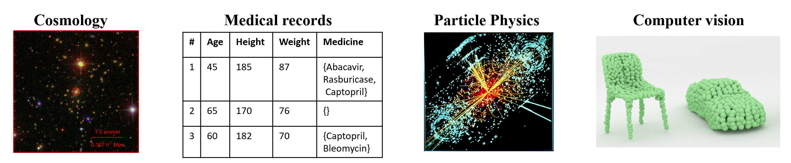

# Set-Tree
### Extending decision trees to process sets
This is the official repository for the paper: "Trees with Attention for Set Prediction Tasks" (ICML21).

This repository contains a prototypical implementaion of Set-Tree and GBeST (Gradient Boosted Set-Tree) algorithms.
Set-Tree package can be downloaded from PIP:
`pip install settree`

## Background and motivation
In many machine learning applications, each record represents a set of items. Problems comprised from sets of items emerge in many fields, from particle physics and cosmology to statistics and computer graphics. In this work, we present a novel tree-based algorithm for processing sets.

## Code

The current implementation is based on Sklean's `BaseEstimator` class and is fully compatible with Sklearn.
It contains two main components: `SetDataset` object, that receives `records` as attribute. `records` is a list of numpy arrays, each array with shape `(n_i, d)` represents a sample. `d` is the dimention of each item in the record and `n_i` is the number of items in the i's record and my differ between records. The second componnent is `SetTree` model inherited from Sklean's `BaseEstimator` and has simillar attributes. For further details and examples see: `example.ipynb`.

